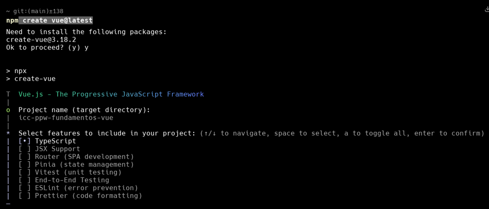
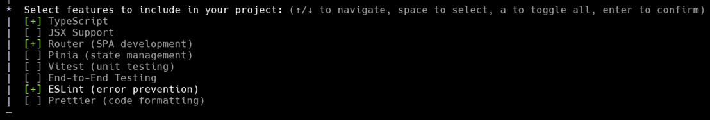
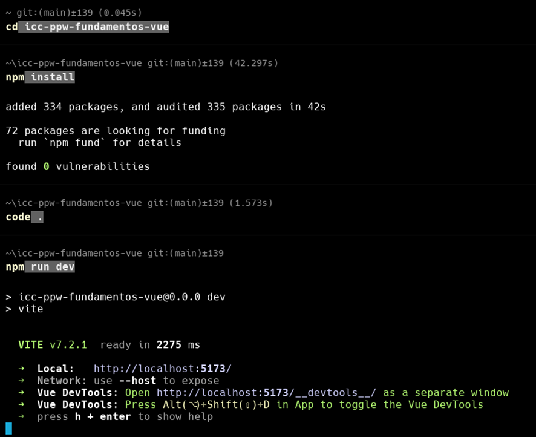
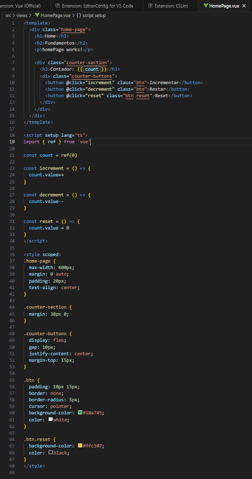
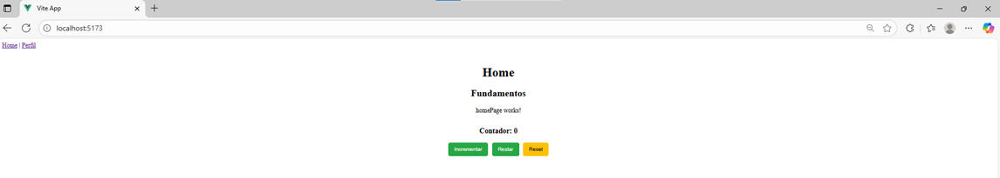
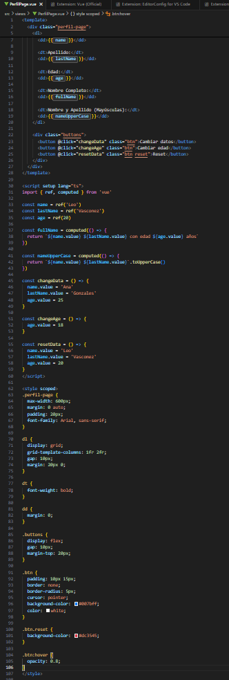
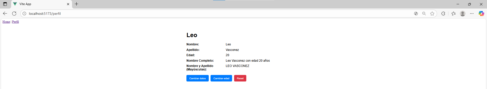
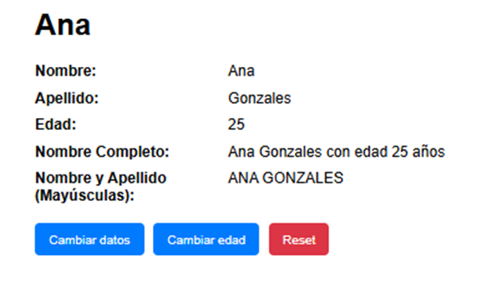
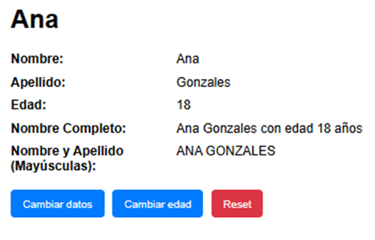
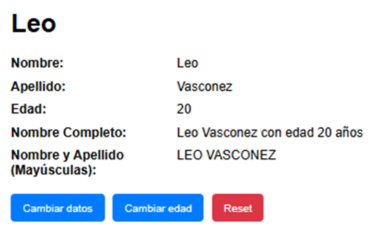

## Programación y Plataformas Web

Frameworks Web: Vue.js

  

## Práctica 2: Fundamentos

**Leo Vásconez**
📧 lvasconezj@est.ups.edu.ec
💻 GitHub: [LeoFV87](https://github.com/LeoFV87)

**Michelle Morocho**
📧 mmorochop3@est.ups.edu.ec
💻 GitHub: [Michelle97-bit](https://github.com/Michelle97-bit)

## Fundamentos de Vue.js

## ¿Qué es Vue.js?

Vue.js es un framework progresivo de JavaScript para construir interfaces de usuario. A diferencia de otros frameworks monolíticos, Vue está diseñado para ser adoptable incrementalmente. La librería central se enfoca solo en la capa de vista, haciendo que sea fácil de integrar con otras librerías o proyectos existentes.

Características principales de Vue.js
Sistema de Componentes: Vue utiliza una arquitectura basada en componentes que permite crear elementos UI reutilizables con su propia lógica y estilos.

**Reactividad**: Vue tiene un sistema de reactividad automática que actualiza la vista cuando los datos cambian, utilizando un DOM virtual para optimizar el rendimiento.

**Directivas**: Vue proporciona directivas especiales (prefijadas con v-) que permiten manipular el DOM de manera declarativa.

**Composición API**: Vue 3 introdujo la Composition API, que ofrece una forma más flexible de organizar y reutilizar la lógica del componente.

**Vue Router**: Biblioteca oficial para el enrutamiento en aplicaciones de una sola página (SPA).

**Vue CLI/ Vite**: Herramientas de desarrollo que facilitan la creación, construcción y mantenimiento de proyectos Vue.

## Rutas
Vue utiliza Vue Router para gestionar la navegación entre diferentes vistas y componentes. Las rutas se definen en un archivo de configuración de rutas y permiten cargar componentes específicos basados en la URL.

## Directivas
Las directivas en Vue son atributos especiales prefijados con v- que aplican comportamiento reactivo al DOM. Algunas directivas comunes:

**v-if, v-else, v-else-if**: Renderizado condicional

**v-for**: Renderizado de listas

**v-bind o** :: Enlace de atributos

**v-on o @**: Manejo de eventos

**v-model**: Enlace bidireccional para formularios

## Servicios/Composables
En Vue, la lógica reutilizable se puede organizar usando composables (funciones que utilizan la Composition API) o servicios tradicionales para compartir datos y funcionalidad entre componentes.

## Filtros y Computed Properties
Vue utiliza propiedades computadas (computed properties) en lugar de pipes para transformar datos. Las propiedades computadas se recalculan automáticamente cuando sus dependencias cambian.

<template>
  

    <!-- Texto a mayúsculas -->
    
{{ textoEnMayusculas }}

    
    <!-- Lista ordenada y filtrada -->
    <li v-for="item in itemsFiltradosYOrdenados" :key="item.id">
      {{ item.name }}
    </li>
  

</template>

## Componentes de Vue.js
Los componentes son los bloques fundamentales de las aplicaciones Vue. Cada componente consta de tres partes principales:

**Template**: Define la estructura HTML del componente usando sintaxis de Vue.

**Script**: Contiene la lógica del componente usando JavaScript/TypeScript.

**Style**: Define los estilos del componente, que pueden ser CSS, SCSS, etc.

## Instalacion VUE en WARP

Primera parte de la instalacion de Vue.

Eleccion de que caracteristicas a instalar.

## Creacion de proyecto VUE

Ejecución de comandos que permiten crear el proyecto en vue, abrirlo en visual studio code y correrlo en el localhost.

## Resultados
Creación de un componente
En Vue.js, los componentes se pueden crear manualmente o usando la CLI. Para crear un componente HomePage, normalmente se ubicaría en src/views/HomePage.vue.

1. Captura de codigo y visualizacion de`HomePage.vue`

En estas capturas podemos observar el codigo de HomePage.vue y de como se despliega en un inicio HomePage.vue al abrir el http://localhost:5173/.

2. Captura de `PerfilPage.vue`

En esta captura podemos observar como se despliega PerfilPage.vue al cambiar a 'Perfil'

3. Captura de Funcionalidades

### Funcionalidad cambiar datos

Se cambian los datos iniciales que tenia la pagina PerfilPage.

### Funcionalidad cambiar edad

El boton cambia la edad de Ana a 18 años.

### Funcionalidad RESET

Se resetean los datos como salian al inicio.

4. Enlace a la pagina de githubPages

(https://LeoFV87.github.io/icc-ppw-fundamentos-vue/)

5. Enlace del repositorio de github del proyecto.

(https://github.com/LeoFV87/icc-ppw-fundamentos-vue)
